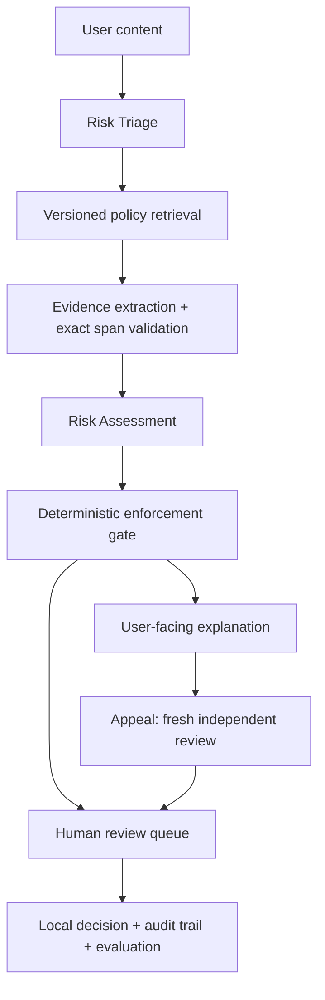

# TrustGuard — AI-Native Financial Scam Review

面向全球内容社区的 Trust & Safety 产品原型：把风险识别、政策依据、原文证据、处置建议、用户解释、申诉及人工复核串成可运行闭环。

Global / Singapore 政策均为项目自拟的 prototype policy，用于验证审核流程，不代表任何平台的内部政策或法律、监管要求。处置操作仅记录在本地，不会影响真实平台账户。

## 3 分钟启动

Python 3.9+（建议 3.11 或 3.12），在此目录执行：

```bash
python3 -m venv .venv
source .venv/bin/activate
# Windows: .venv\Scripts\activate
python -m pip install -r requirements.txt
python -m streamlit run app.py --server.address 127.0.0.1
```

浏览器打开 http://localhost:8501 。macOS 安装后也可执行 `sh start.command` 启动。默认 **Demo 模式无需任何 key**，使用可重复的规则输出，便于体验完整流程。此模式采用有限的正则规则，不调用模型。

OpenAI 模式（可选）：

```bash
cp .env.example .env
# 在 .env 中填写 OPENAI_API_KEY；也可由操作系统环境变量传入。
# OPENAI_MODEL 默认 gpt-4o-mini，可替换为账户可用且支持 Structured Outputs 的模型。
```

在页面切换至 OpenAI，并勾选内容传输确认。模型使用 Responses API + Pydantic Structured Outputs；每次分析两次请求，申诉重新请求。`store=False`，35 秒单次请求超时，最多重试一次；不代表服务商不保留任何日志。Key 不进入源码、数据库或 UI。API 出错、拒绝或缺 key 均进入人工审核，**不会悄悄换成 Demo 结论**。

API 接口依据：[OpenAI Structured Outputs 官方文档](https://developers.openai.com/api/docs/guides/structured-outputs)。已做接口模拟测试；是否完成真实 API 调用见 `docs/VALIDATION.md`。

## 使用示例

1. 选 TG-001：保证收益 + Telegram 导流 → 展示 Triage、P1/P3/P4、证据原文和字符位置。
2. 查看 REMOVE 建议，同时展示人工必审：检测不等于处罚，原型没有自动封号。
3. 在案件页填写审核人、理由并模拟 `remove`。
4. 提交“这是课堂反诈引用”的申诉；系统独立复核，不向模型透露原始判断。新陈述仍需核验。
5. 换审核人记录核验理由并模拟 `allow`；审计历史保留两次判断，overturn rate 可计算。
6. TG-014 定存信息、TG-016 引用诈骗警示、TG-027 持牌声明：查看不同上下文和市场规则对审核结果的影响。
7. 打开评估页，查看误报、召回和人工升级情况。

## 流程与职责



- **LLM is not the policy**：模型提出事实判断，P1–P6 与 SG1–SG2 是本地版本化依据，Python 决策门控负责升级。
- **小知识库 grounding**：先按市场过滤，再按 triage signals 排序；全量保留适用条款及 P5 例外/P6 保障，避免小库 top-k 漏掉保护条款。没有向量数据库，也不宣称 embedding RAG。
- **可核验证据**：每条证据有 source、逐字 quote、policy ID、stance；程序核对原文位置和 policy/signal 映射。机械匹配不能证明语义适用正确，仍需人工判断。
- **风险与影响分开**：P1/P2 支持的违规产生 remove 建议；remove、高严重度、置信度 <0.80、不确定判断、证据冲突、核验需求、模型失败和阶段冲突必须人工。0.80 是原型假设，置信度未校准。
- **上下文信号不是违规**：P3 站外导流、P4 紧迫话术不能单独产生违规处置。自动建议仅 allow/remove，warn 保留为人工可选动作。
- **用户透明度**：用“等待复核”“尚未处罚”说明当前状态；原始解释保留为快照，最终人工结论及理由在案件页单独展示。
- **申诉去锚定**：重新读取原文、原始政策快照和新陈述，不传早期 verdict；同一模型仍可能存在相关偏差，不声称真正独立的人类意见。所有申诉人工最终决定。
- **持久化**：SQLite 保存初审、政策快照、模型/提示版本、申诉、人工理由与时间；事务/修订号阻止陈旧提交，未结申诉防重复。记录不是防篡改审计系统。

## 目录

```text
app.py                 Streamlit 工作台
storage.py             SQLite 案件/申诉/人工操作
agents/
  models.py            Pydantic 数据契约
  provider.py          Demo 与 OpenAI 适配器；triage / assess
  policy.py            按市场过滤与信号排序
  evidence.py          证据和 policy 引用校验
  decision.py          确定性处置门控
  explanation.py       用户解释模板
  appeal.py            独立复核与申诉建议
  workflow.py          全链路编排和失败转人工
policies/              Global 与 Singapore prototype Markdown
data/test_cases.json  36 条人工编写合成案例
evaluation/           指标脚本、基线报告
tests/                门控、失败路径、申诉、页面闭环测试
docs/                 产品说明、验证记录
```

## 运行评估和测试

```bash
python -m pytest -q
python -m evaluation.evaluate --mode demo
# 会调用 API、产生费用；需已配置 key：
python -m evaluation.evaluate --mode openai --output evaluation/latest-openai.json
# 使用实际本地审核记录计算申诉改判：
python -m evaluation.evaluate --db data/trustguard.sqlite3
```

36 条中英混合 **synthetic smoke cases** 包括明显违规、正常、灰区、反诈引用、免责声明、定存/本地产品和指令注入。标签是本项目假设下的人工预期，未经过独立双人标注；同一开发者编写规则与样本，不能作为独立模型 benchmark。

指标口径：

| 指标 | 分母与解释 |
|---|---|
| Precision | TP / (TP + FP)，正类是有 grounding 的违规判断，包括待人工建议 |
| Recall | TP / (TP + FN)，违规被判 uncertain 也算 FN，不隐藏弃判 |
| False Positive Rate | FP / 全部明确正常案例 |
| Human Escalation Rate | 所有升级人工案例 / 全部案例（含灰区） |
| Gray Escalation Rate | 升级人工灰区 / 全部灰区 |
| Binary Abstention Rate | 明确标签中预测 uncertain 的比例 |
| Overturn Rate | 最终行动与原人工行动不同的已结申诉 / 存在原人工结论的已结申诉 |

灰区不进入二分类分母。provider failure 算弃判和人工升级，单列错误数。无分母返回 null。Overturn 包括 allow/warn/remove 间任何最终变更；待结申诉、对未最终裁定建议的质疑不计入分母。没有真实申诉数据时不生成虚假改判率。评估输出包括分市场结果和逐案预测，可定位漏报/误报。

## 运行边界

仅面向本地单用户 demo；**没有登录、权限分离或生产部署安全措施**。审核人姓名仅记录，不能认证。默认绑定 localhost；不要直接放到公网。数据默认 `data/trustguard.sqlite3`，可用 `TRUSTGUARD_DB` 指定；本地明文持久化，优先使用合成文本。分享项目时勿包含 `.env`、数据库或真实内容导出。

文本上限 8000 字符、申诉 4000 字符。不浏览用户链接，不核验 licence 或监管名录，不支持图片，不基于国籍判断风险。未建立真实标注集、置信度校准、跨语种鲁棒性或实际线上效果。上线前需 policy/operations 审核、独立评估、身份权限、数据治理和审核容量验证。
